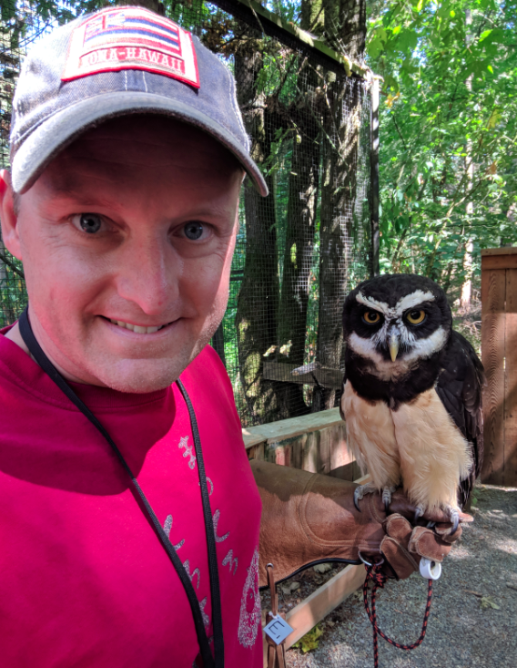

# About Us

Team Sidney Enterprises have been building things since 2018. We are a father-and-son team with a home makerspace, 
and more ideas than free time to work on them. 

## About Sidney

{:height="250px"}

Sidney is a student at West Woodland Elementary school who likes chemistry,
electronics, hacking, and laser cutters.

## About Matt

{:height="250px"}

[Matt](https://www.mdw.la/) works at Google in Seattle, WA, 
and enjoys riding bikes, drinking beer, and programming computers.
