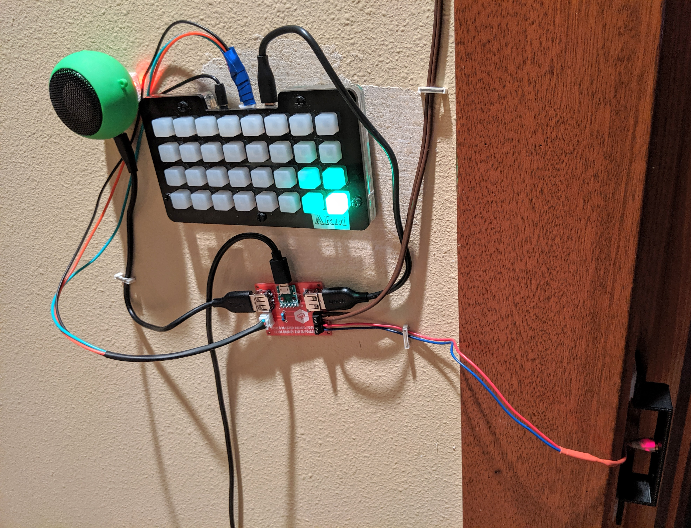
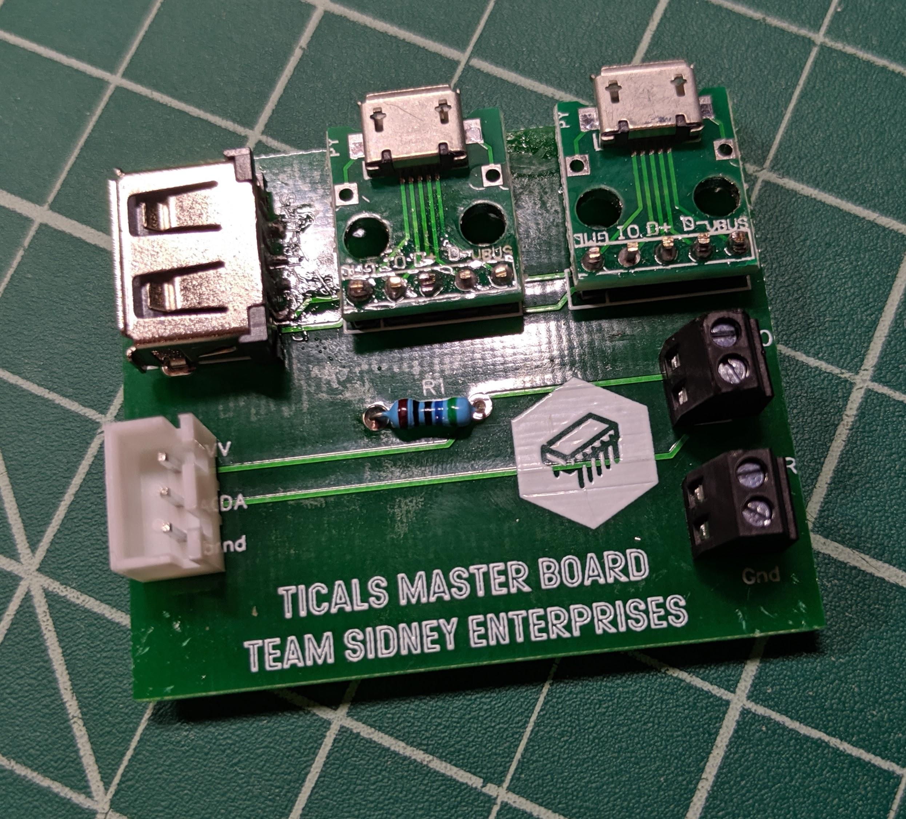
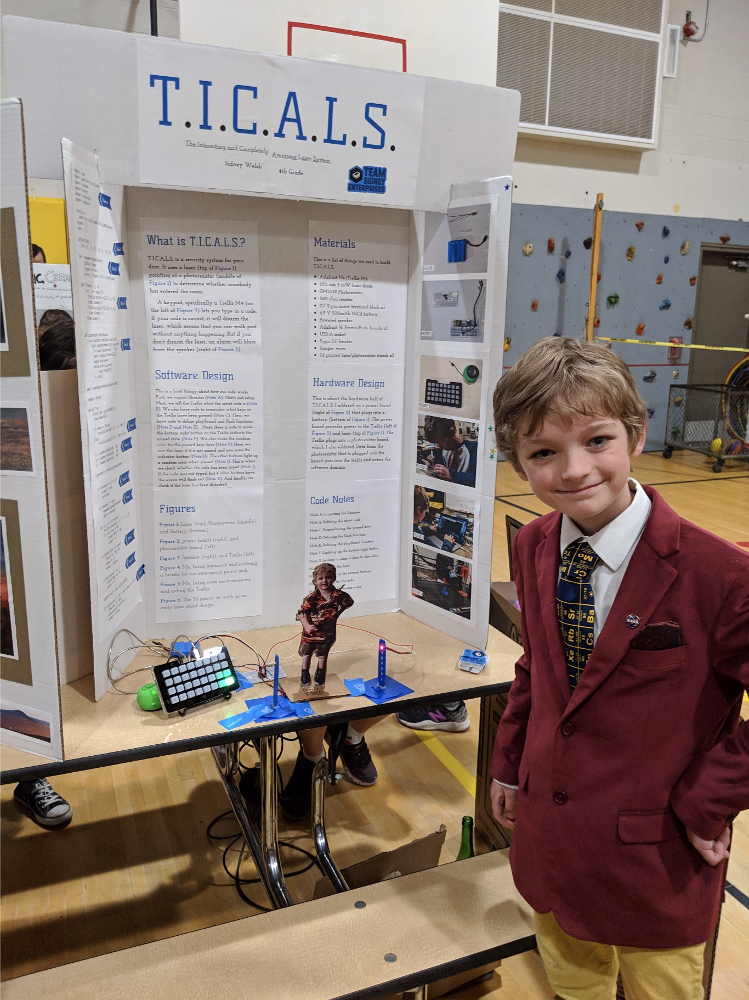

Check out some of Team Sidney Enterprises' projects below.

# T.I.C.A.L.S.

{:.center}
{:height="300px"}
{:height="300px"}
{:height="300px"}

T.I.C.A.L.S. (The Interesting and Completely Awesome Laser System) is a security system for Sidney's door based on a laser break-beam sensor and a [NeoTrellis M4 board](https://www.adafruit.com/product/3938) running CircuitPython. Sidney built this for his fourth-grade science fair project. A custom circuit board is used to route power from a USB charger to both the Trellis and the laser diode. A photoresistor mounted on the opposite side of the door detects whether the laser beam has been broken. When this happens, an audible alarm sounds. A security code can be entered on the Trellis keypad to disarm the alarm.

# Blinky

{:.center}
{:width="40%"}

Blinky is a cloud-controlled, programmable home light display based on
the amazing [Feather HUZZAH32](https://www.adafruit.com/product/3405)
developer board and [DotStar LED strips](https://www.adafruit.com/product/2241),
both from Adafruit.

* [More information, source code, and hardware designs](blinky)

# Infinitube

{:.center}
{:width="40%"}

Infinitube is a web-based "infinite faller" game implemented using
the [Phaser.io](http://phaser.io/) JS framework, with assets sourced
from [Open Game Art](https://opengameart.org/).

* [Play Infinitube online](http://infinitube.rocks/)
* [Source code on Github](https://github.com/mdwelsh/infinitube) 

# Minecraft lamp

{:.center}
{:height="300px"}
{:height="300px"}

This lamp is based on a design from [John Baichtal](https://www.oreilly.com/pub/au/4988),
author of [Minecraft for Makers](http://shop.oreilly.com/product/0636920115298.do). It
is a laser-cut plywood box, spraypainted with laser-cut templates. Inside is an RGB LED,
controlled by a nearby control box containing an Arduino with a custom PCB shield and two
pots: one to control the brightness, and another to control the speed of the color
changing effect.

* [Arduino code on Github](https://github.com/mdwelsh/sidney-projects/tree/master/arduino/PotFader)
* [PCB and case designs](https://github.com/mdwelsh/sidney-projects/tree/master/arduino/hw/minecraft-lamp)

# Laser-cut Acrylic LED lamp

{:.center}
{:width="40%"}

This was our quickest project -- one day! It is a laser-cut wood base
containing an [RGB LED
strip](https://www.amazon.com/gp/product/B01I1BVIQ4/ref=oh_aui_search_detailpage?ie=UTF8&psc=1)
with a remote control. A laser-etched acrylic sheet sits atop the base
and is lit from below.

# Raspberry Pi Day/Night Clock

{:.center}
{:width="40%"}

This is a clock based on a Raspberry Pi mated with a [Pimoroni Unicorn
HAT HD](https://www.adafruit.com/product/3580) 16x16 RGB LED display.
It shows different images depending on the time of day, to help
Sidney's little brother know when he's allowed to get out of bed in
the morning.

* [Python source code on Github](https://github.com/mdwelsh/sidney-projects/tree/master/pi/theoclock)

